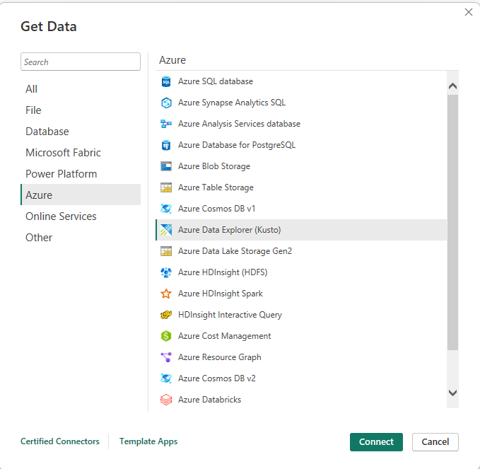
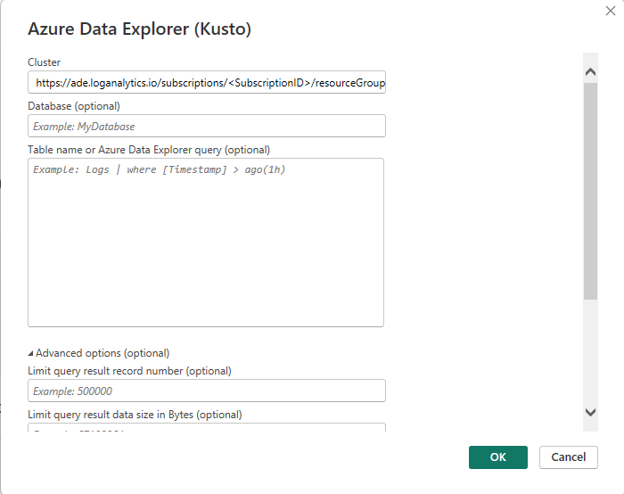

# Connect Sentinel Log Analytics to Power BI

This guide walks you through connecting Microsoft Sentinel Log Analytics workspace to Power BI Desktop for advanced reporting and visualization.

## Prerequisites

- Power BI Desktop installed
- Access to Azure Sentinel Log Analytics workspace
- Appropriate permissions to access the workspace data

## Step-by-Step Instructions

### 1. Launch Power BI Desktop
Open Power BI Desktop on your machine.

### 2. Connect to Azure Data Explorer
1. Click **Get Data** from the Home ribbon
2. Search for and select **Azure Data Explorer (Kusto)**
3. Click **Connect**



### 3. Configure Connection Settings
In the Azure Data Explorer connection dialog:

1. **Cluster**: Enter the Log Analytics workspace URL using the following format:
   ```
   https://ade.loganalytics.io/subscriptions/<SubscriptionID>/resourceGroups/<ResourceGroupName>/providers/Microsoft.OperationalInsights/workspaces/<WorkspaceName>
   ```

2. **Replace the placeholders** with your actual values:
   - `<SubscriptionID>`: Your Azure subscription ID
   - `<ResourceGroupName>`: The resource group containing your workspace
   - `<WorkspaceName>`: Your Log Analytics workspace name

3. Click **OK** to proceed



## Next Steps

After establishing the connection, you can:
- Browse available tables and data
- Create custom queries using KQL (Kusto Query Language)
- Build interactive dashboards and reports
- Schedule data refresh for up-to-date insights

## Tips

> **💡 Pro Tip**: You can find your workspace details in the Azure portal under your Log Analytics workspace properties.

> **⚠️ Note**: Ensure you have the necessary permissions to access the Log Analytics workspace data before attempting to connect.
